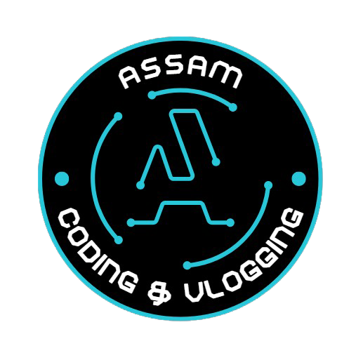

# Live Chat App
    
A real-time live chat application built using **HTML**, **CSS**, **JavaScript**, **Firebase**, and **Bootstrap**. This project demonstrates how to create a fully functional and responsive chat interface powered by Firebase's Realtime Database for seamless communication.

---

## Features
- Real-time messaging with Firebase Realtime Database.  
- Responsive design using Bootstrap.  
- User-friendly interface with timestamps and user avatars.  
- Lightweight and efficient front-end built with HTML, CSS, and JavaScript.

---

## Firebase Setup
- Go to the Firebase Console.
- Create a new project.
- Add your web app and copy the Firebase configuration.
- Replace the Firebase configuration object in your JavaScript file.
- Enable Realtime Database in your Firebase project and set the rules to allow read/write

# Project Demo
Watch the full tutorial on my YouTube channel: [Assam Coding & Vlogging](https://youtu.be/5DObdvKKDsE)

# SUBSCRIBE [Assam Coding & Vlogging](https://www.youtube.com/@AssamCodingVlogging) for more contents like this

